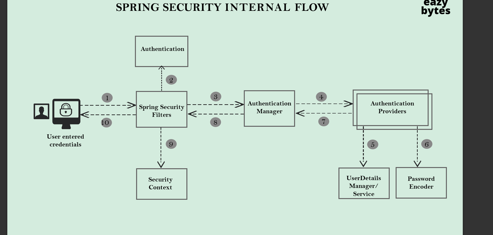
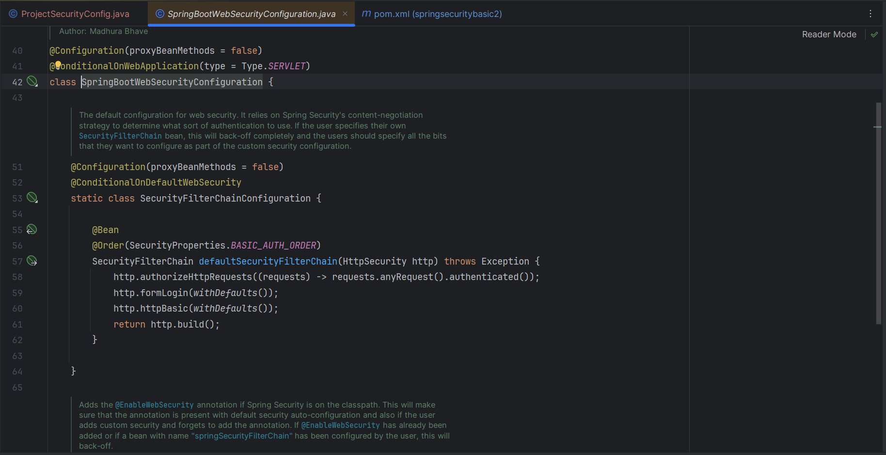

https://github.com/eazybytes/springsecurity6

https://docs.spring.io/spring-boot/docs/current/reference/html/application-properties.html

IMPORTANT NOTE
👉 IMPORTANT NOTE
Starting from Spring Security 6.1 and Spring Boot 3.1.0 versions, the Spring Security framework team recommends using the Lambda DSL style for configuring security for APIs, web paths, etc. Consequently, they have deprecated a few methods within the framework. These deprecated methods are planned to be removed in Spring Security 7, which is expected to be released in the next 2-3 years. This timeframe allows all developers sufficient time for migrating their code.

However, there's no need to worry as this change does not alter the underlying concepts, . Instead of using normal Java configurations, we will now employ the Lambda DSL. Below, you will find an example code snippet illustrating the differences between the two styles:

With out Lambda DSL

With Lambda DSL

Please note that the course is recorded using Spring Boot 3 and Spring Security 6 versions, where normal Java style configurations are used instead of Lambda DSL. Therefore, I encourage you to follow the videos to understand the concepts, methods, configurations, etc., and try to use Lambda DSL style configurations.

For your reference, I have updated the code in the GitHub repository to use the Lambda DSL style. You should be able to comprehend the Lambda DSL style, but if you have any questions, please feel free to reach out to me.

The Lambda DSL was created to accomplish to following goals:

Automatic indentation makes the configuration more readable.

The is no need to chain configuration options using .and()

The Spring Security DSL has a similar configuration style to other Spring DSLs such as Spring Integration and Spring Cloud Gateway.

Please refer to the following link for the official note regarding this change from the Spring Security team:

https://docs.spring.io/spring-security/reference/migration-7/configuration.html

Thank much. Let's have fun and learn together.

Madan