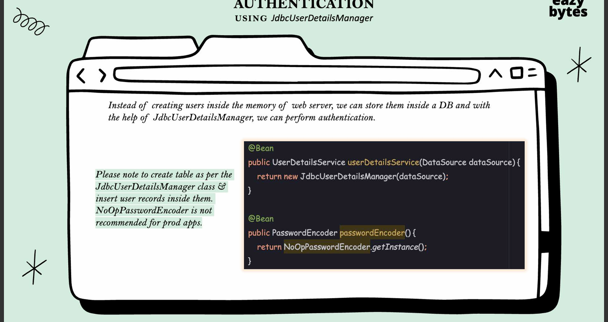

# Spring Security Notes

Spring Security handles

- Security
    - How can I implement security to my web application? so that there wont be any security breaches in my application?
- Passwords
    - How to store passwords validate them , encode ,decode them using industry standards encryption techniques
- Users and Roles
    - How to maintain the user level security based on their roles and grants associated to them?
- Multiple Logins
    - How can I implemente a mechanism where the user will login only use and start using my application
- Fine Grained Security
    - How can I implement security at each level of my application using authorization rules?
- CSRF and CORS
    - What is CSRF and CORS restrictions.How to overcome them?
- JWT and OAuth2
    - What is JWT and OAuth2? How can I protect my web application using them?
- Preventing Attacks
    - How to prevent attacks like bruteforce , stealing of data a,session fixation etc?

Course Agenda
-------------
- Welcome to the world of Spring Security
- Securing a web app using Spring Security
- Important Interfaces , Classes , Annotations of Spring Security
- Configuring Authentication & Authorization for a web app
- Implementing role based access using ROLES,AUTHORITIES
- Different strategies that Spring security provides when coming to passwords
- Method level security using Spring Security
- How to handle most common attacks like CORS,CSRF,Spring Session Fixation etc
- Deep dive on JWT & its role in Authentication & Authorization
- Exploring Authorization Servers available like Keycloak
- Important topics of Security like Hashing,Tokens & many more

Spring Security Project Roadmap
-------------------------------
- Milestone 1: 
  - Firstly we will create a simple spring security project and enable basic security in it 
- Milestone 2: 
  - Authentication using login screen will be implemented along with the URLs security ,CSRF and CORS protection
- Milestone 3: 
  - Authorization will be implemented using roles and authorities
- Milestone 4:
  - Method level security will be implemented along with custom filters in the authentication and authorization process
- Milestone 5:
  - Finally the application will be enhanced with OAuth2/OpenID using JWT security which is the most common security approach in the industry


Spring Security Internal Flow

- Spring Security Filters
    - A Series of Spring Security Filters intercept each request and work together to identify if Authentication is
      required or not .If authentication is required accordingly navigate the user to login page or use the existing
      details stored during intial authentication
- Authentication
    - Filters like UsernamePasswordAuthenticationFilter will extract username/password from HTTP request & prepare
      Authentication type object .Because Authentication is the core standard of storing authenticated user details
      inside Spring Security framework
- Authentication Manager
    - Once received request from filter , it delegates the validating of the user details to the authentication provider
      available . Since there can be multiple providers inside an app , it is the responsibility of the Authentication
      Manager to manage all the authentication providers available
- Authentication Provider
    - AuthenticationProviders has all the core logic of validating user details for authentication.
- UserDetailsManager/UserDetailsService
    - Once the user is authenticated , the user details are stored in UserDetailsManager/ UserDetailsService . This is
      the place where the user details are stored and retrieved for further use
- PasswordEncoder
    - Password Encoder is used to encode the password and store it in the database. It is also used to decode the
      password and validate it during authentication process
- Security Context
    - Security Context is the place where the authenticated user details are stored and retrieved for further use.


Search for using double tap shift find this class **SpringBootWebSecurityConfiguration**


Approach 1: Using **InMemoryUserDetailsManager**


```java

@Configuration
public class ProjectSecurityConfig {

    @Bean
    public InMemoryUserDetailsManager userDetailsService() {
//  Approach 1 where we use withDefaultPasswordEncoder() method while creating the user details
        UserDetails admin = User
                .withDefaultPasswordEncoder()
                .username("admin")
                .password("12345")
                .authorities("admin").build();
        UserDetails user = User
                .withDefaultPasswordEncoder()
                .username("user")
                .password("12345")
                .authorities("read").build();

        return new InMemoryUserDetailsManager(admin, user);
    }
}
```

Approach 2: Using PasswordEncoder


```java

@Configuration
public class ProjectSecurityConfig {
    @Bean
    public InMemoryUserDetailsManager userDetailsService() {
//     Approach 2 where we use NoOpPasswordEncoder Bean
        UserDetails admin = User
                .withUsername("admin")
                .password("12345")
                .authorities("admin").build();
        UserDetails user = User
                .withUsername("user")
                .password("12345")
                .authorities("read").build();

        return new InMemoryUserDetailsManager(admin, user);
    }

    @Bean
    public PasswordEncoder passwordEncoder() {
        return NoOpPasswordEncoder.getInstance();
    }
}
```


Authentication using JdbcUserDetailsManager




```java
package org.springframework.security.provisioning;
public class InMemoryUserDetailsManager implements UserDetailsManager, UserDetailsPasswordService {


    @Override
    public UserDetails loadUserByUsername(String username) throws UsernameNotFoundException {
        UserDetails user = this.users.get(username.toLowerCase());
        if (user == null) {
            throw new UsernameNotFoundException(username);
        }
        return new User(user.getUsername(), user.getPassword(), user.isEnabled(), user.isAccountNonExpired(),
                user.isCredentialsNonExpired(), user.isAccountNonLocked(), user.getAuthorities());
    }
}
```
UserDetails.java


User.java


